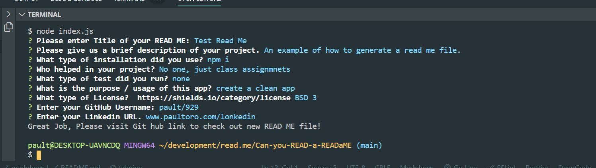
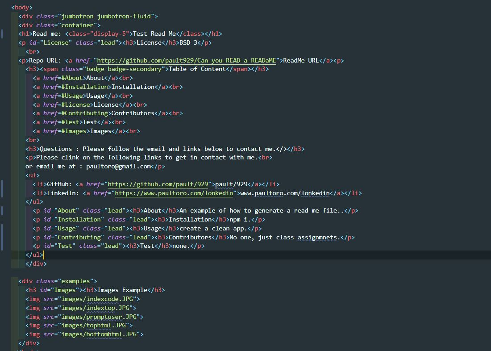

# Title:
# Link to site:
# List of Technologies
# What does APP/Program do
# Screen Shoots 
# License
# Collaborators

# Read Me Generator:
The following link takes you to My Read-me:
https://pault929.github.io/Can-you-READ-a-READaME/

You will have to have VSCode to open the App.

I used Node Modules, Javascript, and JSon to deploy this app.

This app generates a Read me file by asking the user to answer a few questions.

There were no collaborators to this assignment. 

