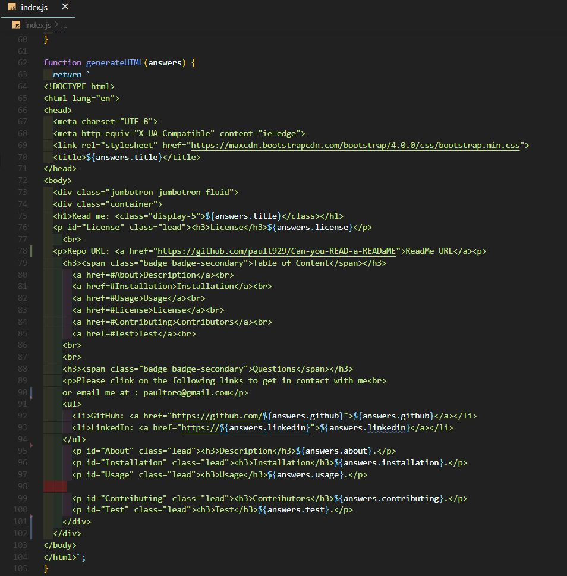
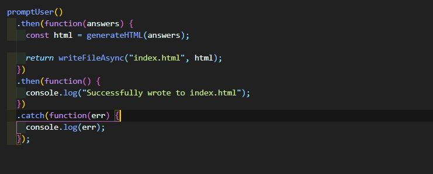
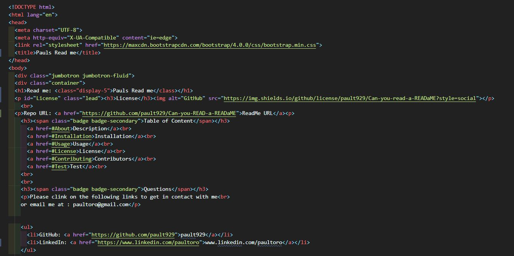
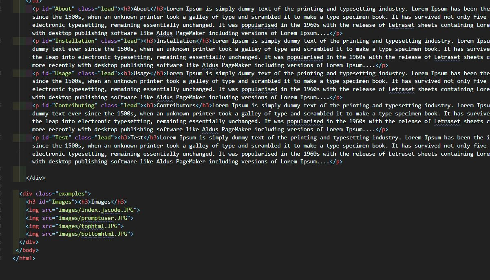

<!DOCTYPE html>
<html lang="en">
<head>
  <meta charset="UTF-8">
  <meta http-equiv="X-UA-Compatible" content="ie=edge">
  <link rel="stylesheet" href="https://maxcdn.bootstrapcdn.com/bootstrap/4.0.0/css/bootstrap.min.css">
</head>
<body>
  

  

  <h1>Read me: <class="display-5">Paul's Project</class></h1>
  
<h3>License</h3>BSD 3

     
  
Repo URL: <a href="https://github.com/pault929/Can-you-READ-a-READaME">ReadMe URL</a>
 
    <h3>Table of Content</h3>
      <a href=#About>About</a> 
      <a href=#Installation>Installation</a> 
      <a href=#Usage>Usage</a> 
      <a href=#License>License</a> 
      <a href=#Contributing>Contributors</a>  
      <a href=#Test>Test</a> 
      <a href=#Images>Images</a> 
     
    <h3>Questions : Please follow the email and links below to contact me.</></h3>
    
Please clink on the following links to get in contact with me. 
    or email me at : paultoro@gmail.com
 
    <ul>
      <li>GitHub: <a href="https://github.com/pault929">pault929</a></li>
      <li>LinkedIn: <a href="https://www.Google.com">www.Google.com</a></li>
    </ul>
      
<h3>About</h3>Lorem Ipsum is simply dummy text of the printing and typesetting industry. Lorem Ipsum has been the industry's standard dummy text ever since the 1500s, when an unknown printer took a galley of type and scrambled it to make a type specimen book. It has survived not only five centuries, but also the leap into electronic typesetting, remaining essentially unchanged. It was popularised in the 1960s with the release of Letraset sheets containing Lorem Ipsum passages, and more recently with desktop publishing software like Aldus PageMaker including versions of Lorem Ipsum....

      
<h3>Installation</h3>Lorem Ipsum is simply dummy text of the printing and typesetting industry. Lorem Ipsum has been the industry's standard dummy text ever since the 1500s, when an unknown printer took a galley of type and scrambled it to make a type specimen book. It has survived not only five centuries, but also the leap into electronic typesetting, remaining essentially unchanged. It was popularised in the 1960s with the release of Letraset sheets containing Lorem Ipsum passages, and more recently with desktop publishing software like Aldus PageMaker including versions of Lorem Ipsum....

      
<h3>Usage</h3>Lorem Ipsum is simply dummy text of the printing and typesetting industry. Lorem Ipsum has been the industry's standard dummy text ever since the 1500s, when an unknown printer took a galley of type and scrambled it to make a type specimen book. It has survived not only five centuries, but also the leap into electronic typesetting, remaining essentially unchanged. It was popularised in the 1960s with the release of Letraset sheets containing Lorem Ipsum passages, and more recently with desktop publishing software like Aldus PageMaker including versions of Lorem Ipsum....

      
<h3>Contributors</h3>Lorem Ipsum is simply dummy text of the printing and typesetting industry. Lorem Ipsum has been the industry's standard dummy text ever since the 1500s, when an unknown printer took a galley of type and scrambled it to make a type specimen book. It has survived not only five centuries, but also the leap into electronic typesetting, remaining essentially unchanged. It was popularised in the 1960s with the release of Letraset sheets containing Lorem Ipsum passages, and more recently with desktop publishing software like Aldus PageMaker including versions of Lorem Ipsum....

      
<h3>Test</h3>Lorem Ipsum is simply dummy text of the printing and typesetting industry. Lorem Ipsum has been the industry's standard dummy text ever since the 1500s, when an unknown printer took a galley of type and scrambled it to make a type specimen book. It has survived not only five centuries, but also the leap into electronic typesetting, remaining essentially unchanged. It was popularised in the 1960s with the release of Letraset sheets containing Lorem Ipsum passages, and more recently with desktop publishing software like Aldus PageMaker including versions of Lorem Ipsum....

    
    

  

    <h3 id="Images"><h3>Images</h3>
    
    
    
    
  

 </body>
</html>