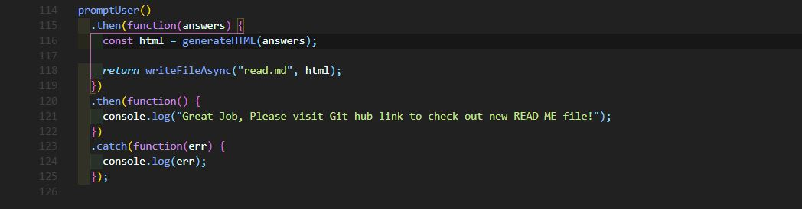
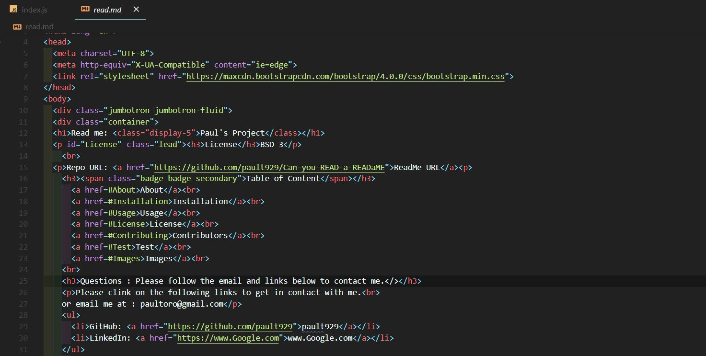

<!DOCTYPE html>
<html lang="en">
<head>
  <meta charset="UTF-8">
  <meta http-equiv="X-UA-Compatible" content="ie=edge">
  <link rel="stylesheet" href="https://maxcdn.bootstrapcdn.com/bootstrap/4.0.0/css/bootstrap.min.css">
</head>

<body>
  

  

  <h1>Read me: <class="display-5">Test Read Me</class></h1>
  
<h3>License</h3>BSD 3

     
  
Repo URL: <a href="https://github.com/pault929/Can-you-READ-a-READaME">ReadMe URL</a>
 
    <h3>Table of Content</h3>
      <a href=#About>About</a> 
      <a href=#Installation>Installation</a> 
      <a href=#Usage>Usage</a> 
      <a href=#License>License</a> 
      <a href=#Contributing>Contributors</a>  
      <a href=#Test>Test</a> 
      <a href=#Images>Images</a> 
     
    <h3>Questions : Please follow the email and links below to contact me.</></h3>
    
Please clink on the following links to get in contact with me. 
    or email me at : paultoro@gmail.com
 
    <ul>
      <li>GitHub: <a href="https://github.com/pault/929">pault/929</a></li>
      <li>LinkedIn: <a href="https://www.paultoro.com/lonkedin">www.paultoro.com/lonkedin</a></li>
    </ul>
      
<h3>About</h3>An example of how to generate a read me file..

      
<h3>Installation</h3>npm i.

      
<h3>Usage</h3>create a clean app.

      
<h3>Contributors</h3>No one, just class assignmnets.

      
<h3>Test</h3>none.

    </ul>
    

  

    <h3 id="Images"><h3>Images Example</h3>
    
    
    
    
    
  

 </body>
</html>